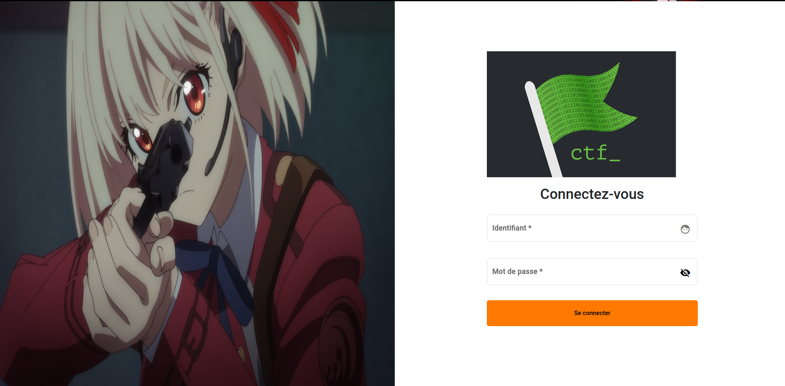
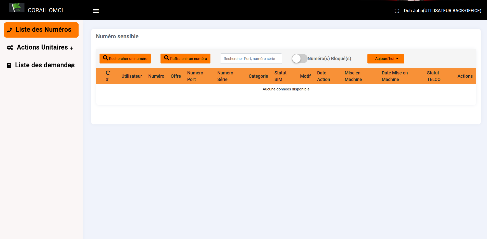

# Lycoris-project


## Prérequis

- Apache/2.4.37
- Tomcat 9 avec Java 8 (JDK 1.8)
- MariaDB 10.6
- Redis 6.2.7 (Minimum)
- 2 Serveurs sous Rocky Linux 8 de 2GB de RAM et de 2 CPU feront l'affaire 
(Apache et tomcat sur le serveur 1 et MariaDB et Redis sur le serveur 2) 


## Situation

Salut expert ! <br>
Nous avons besoin de toi pour mettre en place la plateforme lycoris. La partie frontend/backoffice a été faite avec de l'angular. Le code source (brut) se trouve dans le dossier "lycoris-app". Et la partie backend (l'api lycoris) a été faite avec du java. Son code source se trouve dans le dossier "lycoris-api". 

Notre application se présente comme suit: 




```
username = player
password = player

Login page url: https://your_domain/#/authentication/signin
Ex: https://widal-lycoris.dev01.ovh.smile.ci/#/authentication/signin
```




L'authentification à l'application se fait grâce à une appelle API. Vous devez configurer l'adresse de l'api dans le fichier **"environment.prod.ts"** qui se trouve dans le dossier "lycoris-app". Ci-dessous un exemple de configuration:

```
apiUrl: ' https://widal-lycoris.dev01.ovh.smile.ci/api/lycoris-api/', 
```
**NB:** L'endpoint **/api/lycoris-api/** ne doit pas être retiré.

Notre app backend aura besoin de communiquer avec une BD et Redis. Vous devez donc configurer les accès dans le fichier **"lycoris-api/src/main/resources/filtered/application-production.properties"** qui se trouve dans le dossier "lycoris-api". Ci-dessous un exemple de configuration:

```
...
spring.datasource.url=jdbc:mysql://192.168.34.55:3306/db_lycoris?autoReconnect=true&useSSL=false
spring.datasource.username=lycoris_user
spring.datasource.password=mysuperbdpassword

...
spring.redis.host=192.168.34.55
spring.redis.password=mysuperredispassword
```

**NB:** Il faudra forcément définir un mot de passe au niveau de redis.

Concernant la BD vous devez utiliser db_lycoris.sql pour mettre en place la BD. (DB_NAME: db_lycoris)


## Info (IMPORTANT)

- Le code java devra être buildé avec le profil "production". Il faudra donc ajouter l'option **-Dspring.profiles.active=production** à la commande de build. Si le build a réussi, vous devriez voir un dossier **target** qui contiendra un fichier **.war**.

- Le code angular peut-être builder avec du nodejs 14 (node 14). Pas besoin de préciser un profile. Si le build a réussi, vous devriez voir un dossier **dist** contenant les ressources de l'app web Lycoris prêt à être déployé. 


